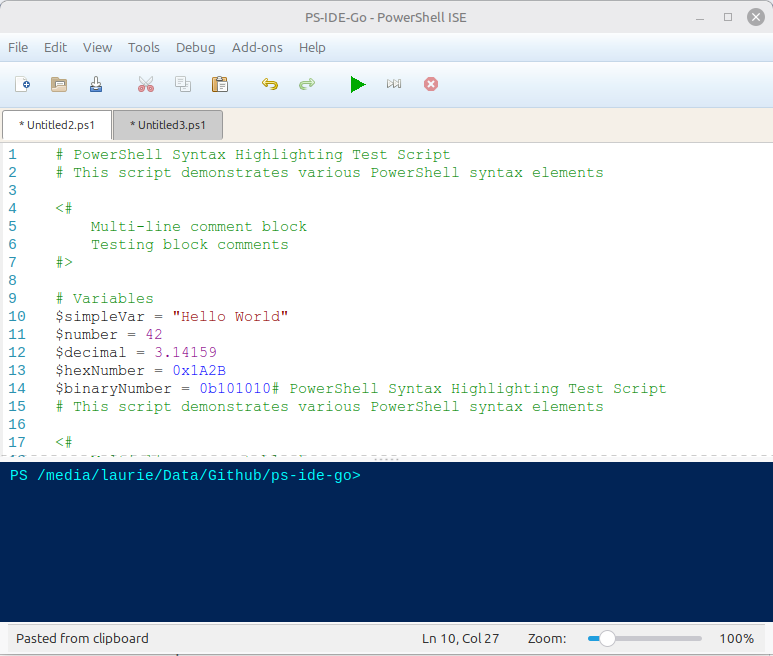

# PS-IDE-Go

A modern PowerShell 7 IDE built with Go and GTK3, providing a lightweight and native development environment for PowerShell scripting on Linux.

[](https://github.com/LaurieRhodes/ps-ide-go/actions/workflows/ci.yml)
[](https://github.com/LaurieRhodes/ps-ide-go/actions/workflows/release.yml)
[](https://goreportcard.com/report/github.com/LaurieRhodes/ps-ide-go)



## Features

- 📝 **Syntax Highlighting** - PowerShell syntax highlighting powered by Chroma
- ▶️ **Script Execution** - Run PowerShell scripts directly from the IDE
- 💾 **File Management** - Open, edit, and save PowerShell scripts
- 🖥️ **Integrated Console** - Full PowerShell console with translation layer
- 📑 **Tab Management** - Work with multiple scripts simultaneously
- ✂️ **Code Snippets** - 18 built-in PowerShell templates (Ctrl+J)
- 🔍 **Find & Replace** - Search within your scripts
- 🎨 **Native UI** - Fast, responsive GTK3 interface optimized for Linux
- 🚀 **Lightweight** - Single 11MB binary with zero configuration

## Platform Support

| Platform  | Status                | Notes                                     |
| --------- | --------------------- | ----------------------------------------- |
| **Linux** | ✅ **Fully Supported** | Native GTK3, optimized, one-liner install |
| **macOS** | ⚠️ **Experimental**   | Requires GTK3 via Homebrew, not native UI |

> **Note:** PS-IDE-Go is designed primarily for Linux. While builds are provided for macOS, it requires additional setup and doesn't provide the native experience that Linux users enjoy. For v1.0.0, we recommend Linux for the best experience.

## Installation

### Linux (Recommended) 🚀

**One-command install:**

```bash
curl -sSL https://raw.githubusercontent.com/LaurieRhodes/ps-ide-go/main/install.sh | bash
```

This will automatically:

- Install PowerShell and GTK3 runtime dependencies
- Download the latest release binary for your architecture
- Install to `~/.local/bin` (or `/usr/local/bin` with sudo)
- Set up everything ready to run

**Manual binary install:**

1. Install runtime dependencies:
   
   ```bash
   # Ubuntu/Debian
   sudo apt install powershell libgtk-3-0
   ```

# Fedora/RHEL

sudo dnf install powershell gtk3

# Arch Linux

sudo pacman -S powershell gtk3

```
Or use our convenience script:
```bash
./install-runtime.sh
```

2. Download and extract:
   
   ```bash
   # Download latest release
   wget https://github.com/LaurieRhodes/ps-ide-go/releases/latest/download/ps-ide-linux-amd64.tar.gz
   ```

# Extract

tar xzf ps-ide-linux-amd64.tar.gz

# Move to PATH

sudo mv ps-ide /usr/local/bin/

# or

mv ps-ide ~/.local/bin/

```
3. Run:
```bash
ps-ide
```

### macOS (Experimental) ⚠️

**Prerequisites:**

```bash
# Install Homebrew if not already installed
/bin/bash -c "$(curl -fsSL https://raw.githubusercontent.com/Homebrew/install/HEAD/install.sh)"

# Install dependencies
brew install powershell gtk+3
```

**Install PS-IDE-Go:**

```bash
# Download for your architecture
# Intel Macs:
wget https://github.com/LaurieRhodes/ps-ide-go/releases/latest/download/ps-ide-darwin-amd64.tar.gz
# Apple Silicon:
wget https://github.com/LaurieRhodes/ps-ide-go/releases/latest/download/ps-ide-darwin-arm64.tar.gz

tar xzf ps-ide-darwin-*.tar.gz
chmod +x ps-ide

# Remove quarantine
xattr -d com.apple.quarantine ps-ide

# Move to PATH
sudo mv ps-ide /usr/local/bin/
```

**Note:** GTK3 apps on macOS don't have native macOS look and feel. Consider using a native macOS PowerShell editor for better integration.

## Runtime Requirements

| Platform  | Required                        | Optional |
| --------- | ------------------------------- | -------- |
| **Linux** | PowerShell, GTK3 runtime        | -        |
| **macOS** | PowerShell, GTK3 (via Homebrew) | -        |

**Recommended:** Use Linux for the best experience. PS-IDE-Go is designed and optimized for Linux systems.

## Building from Source

**For developers who want to modify or contribute to ps-ide-go.**

### Prerequisites

- Go 1.21 or higher
- GTK3 development libraries
- PowerShell 7.x
- C compiler (gcc/clang)

### Quick Start (Linux)

```bash
# Clone repository
git clone https://github.com/LaurieRhodes/ps-ide-go.git
cd ps-ide-go

# Install development dependencies
./install-dev-deps.sh

# Build
make build

# Run
./ps-ide
```

### Manual Setup

**Linux (Ubuntu/Debian):**

```bash
sudo apt install golang-go powershell \
    build-essential pkg-config \
    libgtk-3-dev libglib2.0-dev libcairo2-dev libpango1.0-dev

go mod download
go build -o ps-ide ./cmd/ps-ide
```

**macOS:**

```bash
brew install go powershell pkg-config gtk+3

go mod download
go build -o ps-ide ./cmd/ps-ide
```

### Build Options

```bash
# Build for current platform
make build

# Build for Linux (recommended platform)
make build-linux

# Run tests
make test

# Run linting
make lint
```

## Usage

Start the IDE:

```bash
ps-ide
```

Or open a specific file:

```bash
ps-ide script.ps1
```

### Keyboard Shortcuts

- `Ctrl+N` - New file
- `Ctrl+O` - Open file
- `Ctrl+S` - Save file
- `Ctrl+W` - Close tab
- `Ctrl+F` - Find
- `Ctrl+H` - Replace
- `Ctrl+J` - Insert snippet
- `F5` - Run script
- `Ctrl+C` - Stop execution

## Development

### Project Structure

```
ps-ide-go/
├── cmd/ps-ide/          # Main application entry point
│   ├── translation/     # PowerShell translation layer
│   ├── main.go          # Application entry point
│   ├── console.go       # Terminal interface
│   ├── tabs.go          # Tab management
│   ├── snippets.go      # Code snippets
│   └── ...              # Other UI components
├── internal/            # Internal packages
│   ├── config/          # Configuration management
│   └── highlighter/     # Syntax validation
├── pkg/                 # Public packages
│   └── config/          # Configuration types
├── docs/                # Documentation
└── test/                # Test files
```

### Testing

```bash
# Run tests
make test

# Run tests with coverage
make test-coverage
```

### Linting

```bash
# Run linter
make lint

# Auto-fix linting issues
make lint-fix

# Full pre-publish check
make pre-publish
```

### CI/CD

This project uses GitHub Actions for continuous integration and automated releases:

- **CI Workflow** - Runs on every push/PR
  
  - Tests on multiple Go versions (1.21, 1.22, 1.23)
  - Runs linting with golangci-lint
  - Builds and verifies the binary

- **Release Workflow** - Triggered by version tags
  
  - Builds binaries for Linux (amd64, arm64) and macOS (amd64, arm64)
  - Creates GitHub Release with all binaries
  - Includes SHA256 checksums for verification

**Creating a release:**

```bash
# Tag and push
git tag -a v1.0.0 -m "Release v1.0.0"
git push origin v1.0.0

# GitHub Actions automatically builds and publishes
```

## What's Included

PS-IDE-Go is a lightweight, single-binary application optimized for Linux with:

- ✅ **Native GTK3 interface** - Fast, responsive Linux UI
- ✅ **PowerShell integration** - Execute scripts with full console output
- ✅ **Syntax highlighting** - Powered by Chroma (150+ languages)
- ✅ **Code snippets** - 18 built-in PowerShell templates
- ✅ **Tab management** - Work with multiple scripts
- ✅ **Translation layer** - Advanced PowerShell console integration
- ✅ **Zero configuration** - Works out of the box on Linux

**Binary size:** ~11MB (with syntax highlighting)

## Troubleshooting

### Linux

#### "Command not found: ps-ide"

**Solution:** Add install directory to PATH:

```bash
# For ~/.local/bin
echo 'export PATH="$PATH:$HOME/.local/bin"' >> ~/.bashrc
source ~/.bashrc
```

#### "PowerShell (pwsh) not found"

**Solution:** Install PowerShell:

```bash
sudo apt install powershell  # Ubuntu/Debian
```

#### "error while loading shared libraries: libgtk-3.so.0"

**Solution:** Install GTK3 runtime:

```bash
sudo apt install libgtk-3-0  # Ubuntu/Debian
sudo dnf install gtk3         # Fedora
sudo pacman -S gtk3           # Arch
```

### macOS

#### "ps-ide" is damaged and can't be opened

**Solution:** Remove quarantine flag:

```bash
xattr -d com.apple.quarantine ps-ide
```

#### GTK3 not found

**Solution:** Install via Homebrew:

```bash
brew install gtk+3
```

### Build Issues

#### "C compiler not found"

**Solution:** Install build tools:

```bash
sudo apt install build-essential  # Ubuntu/Debian
xcode-select --install            # macOS
```

## Comparison: Install Methods (Linux)

| Method            | Time  | Size  | Best For       |
| ----------------- | ----- | ----- | -------------- |
| **One-liner**     | 2 min | 65MB  | Most users     |
| **Binary + deps** | 3 min | 65MB  | Manual control |
| **From source**   | 8 min | 385MB | Developers     |

**Recommendation:** Use the one-liner install for Linux. For other platforms, consider native alternatives.

## Future Plans

### v1.0.x - Linux Focus

- Linux optimizations and polish
- Snap/Flatpak packaging
- AppImage distribution
- Community feedback integration

### v2.0 - Multi-Platform

- Native macOS UI (SwiftUI or Cocoa)
- Or: Cross-platform rewrite with Electron/Tauri

> **Note:** The current GTK3 implementation works excellently on Linux but has limitations on macOS. Future versions may use platform-native UI frameworks for better experience on all platforms.

## Roadmap

See [CHANGELOG.md](CHANGELOG.md) for planned features and development history.

## Contributing

Contributions are welcome! Please feel free to submit a Pull Request.

1. Fork the repository
2. Create your feature branch (`git checkout -b feature/amazing-feature`)
3. Commit your changes (`git commit -m 'Add amazing feature'`)
4. Push to the branch (`git push origin feature/amazing-feature`)
5. Open a Pull Request

**Development Environment:** We primarily develop and test on Linux. Contributions improving macOS support are especially welcome!

## License

This project is licensed under the MIT License - see the [LICENSE](LICENSE) file for details.

## Author

**Laurie Rhodes**

- GitHub: [@LaurieRhodes](https://github.com/LaurieRhodes)

## Acknowledgments

- Native UI built with [GTK3](https://www.gtk.org/) - The GIMP Toolkit
- Syntax highlighting by [Chroma](https://github.com/alecthomas/chroma)
- GTK bindings by [gotk3](https://github.com/gotk3/gotk3)
- Powered by [PowerShell](https://github.com/PowerShell/PowerShell)

---

**Optimized for Linux.** macOS support is experimental.
